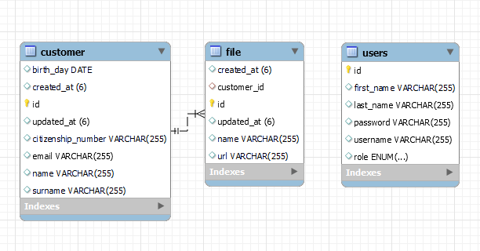

# Spring Boot - Spring Security - JWT Tabanlı Müşteri Arşivleme Sistemi

Spring Boot, Spring Security, RabbitMQ gibi teknolojiler kullanılarak geliştirilmiş bu uygulamada, kullanıcı yetkilendirme ve kimlik doğrulama sisteminin yanı sıra API Authentication uygulaması da içermektedir. Temel olarak amacı tam yetkili bir kullanıcının, belirli rollerle korunan API endpointlerine erişerek müşteri ve dosya yönetimini sağlamaktır. Ayrıca her müşteri kaydında müşteriye RabbitMQ üzerinden email mesajı gönderilmektedir.

#### Frontend (React) uygulaması için: [JWT Based Customer Archiving System - Frontend](https://github.com/bilalmuzafferkose/spring-customer-archiving-system-ui)

## Başlangıç

Projeyi başlatmak ve yerel makinenizde çalıştırmak için aşağıdaki adımları takip edin.

### Gereksinimler

Aşağıdaki yazılımların yüklü olduğundan emin olun:
- Docker
- Docker Compose
- Java (min. JDK 18)

### Kullanılan Teknolojiler
- Spring Boot
- Spring Data JPA
- Spring Security
- JWT (JSON Web Token)
- Docker ve Docker Compose
- MySQL
- RabbitMQ

### Kurulum

1. Repository'yi klonlayın:
   ```bash
   git clone https://github.com/bilalmuzafferkose/spring-customer-archiving-system
   ```
2. Proje dizinine gidin:
    ```bash
    cd spring-customer-archiving-system
    ```
3. Spring Boot uygulamasını başlatın:
    ```bash
    ./mvnw spring-boot:run
    ```
4. Docker Compose ile MySQL ve RabbitMQ servislerini başlatın
    ```bash
    docker-compose up -d
    ```
## Kullanım

Aşağıda proje tarafından sunulan API'lerin kullanımı hakkında bilgiler bulunmaktadır.
Ayrıca ana dizindeki .json uzantılı Postman Collection ile Postman üzerinden de API istekleri yapılabilir.


### Register

**Endpoint:** `/register` (POST)

**Açıklama:** User kaydı oluşturur ve kayıt sonrası bir token üretir

**Parametreler:**
- `firstName` (zorunlu)
- `lastName` (zorunlu)
- `username` (zorunlu)
- `password` (zorunlu)
- `role` (zorunlu)

### Login

**Endpoint:** `/login` (POST)

**Açıklama:** Kullanıcı girişi yapar.

**Parametreler:**
- `username` (zorunlu)
- `password` (zorunlu)

### Save Customer

**Endpoint:** `/v1/customer/save` (POST)

**Açıklama:** Müşteri ekler. Sonrasında RabbitMQ ile welcome emaili gönderir.

### Get All Customer

**Endpoint:** `/v1/customer/getAll` (GET)

**Açıklama:** Tüm müşterileri getirir.

### Get Customer

**Endpoint:** `/v1/customer/{id}` (GET)

**Açıklama:** Müşteriyi getirir.

### Delete Customer

**Endpoint:** `/v1/customer/delete/{citizenshipNumber}` (DELETE)

**Açıklama:** Müşteriyi siler.

### Update Customer

**Endpoint:** `/v1/customer/update/{citizenshipNumber}` (UPDATE)

**Açıklama:** Müşteriyi günceller.

### Save File

**Endpoint:** `/v1/file/upload` (POST)

**Açıklama:** Sunucuya statik olarak ilgili dosyayı yükler. Bilgilerini ise veritabanında saklar.

### Delete File

**Endpoint:** `/v1/file/delete/{fileId}` (DELETE)

**Açıklama:** Sunucudan dosyayı siler. Veritabanından ilgili dosya kaydını siler.

### Get All Files

**Endpoint:** `/v1/file/getAll` (GET)

**Açıklama:** Bütün dosyaları getirir.

### Get File (Download)

**Endpoint:** `/v1/file/{filename}` (GET)

**Açıklama:** Dosyayı getirir.

### Update File

**Endpoint:** `/v1/file/update/{fileId}/{customerId}` (PUT)

**Açıklama:** Dosyayı günceller.

### Swagger UI

**Endpoint:** `/swagger-ui/index.html` (GET)

**Açıklama:** Swagger UI gösterir.

## ER Diagram

User isimli Entity ile Customer arasında bir bağlantı olmadan proje sağlanmıştır. Customer ile File arasında OneToMany ilişki vardır.



## RabbitMQ ile Mail Göndermek

1. Eğer RabbitMQ ile email göndermek isterseniz application.properties dosyasındaki aşağıdaki alanların düzenlenmesi gerekiyor. Mailin gönderilmesi icin Google güvenlik ayarlarından App Password alınmasi gerekiyor.
    ```bash
    spring.mail.username=
    spring.mail.password=
    ```
   
Test amaçlı gönderilen mail aşağıda örnek olarak gösterilmiştir.

